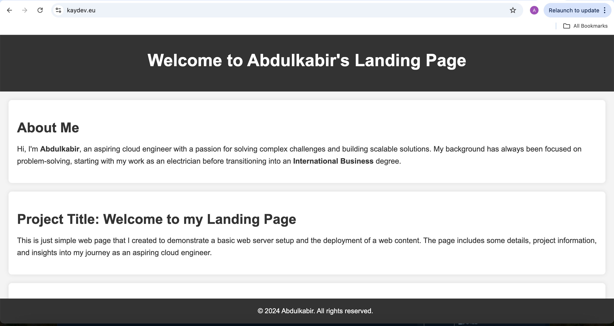
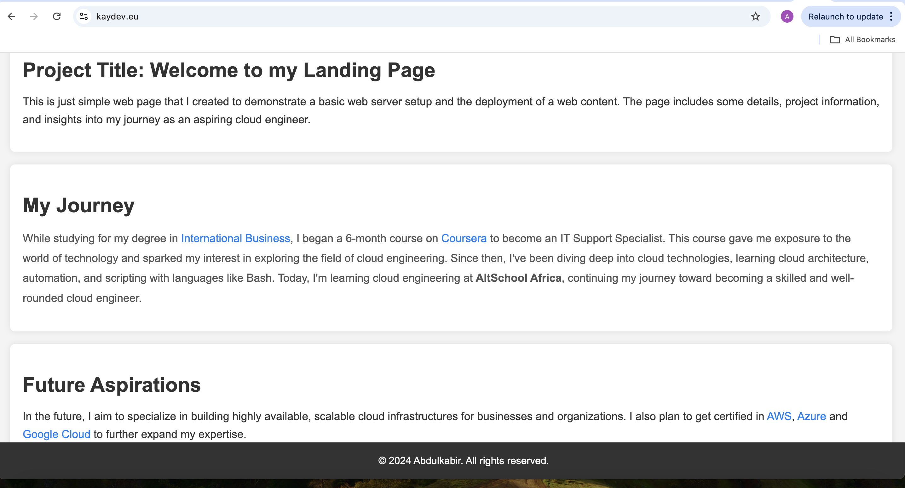

# Landing Page Project

This project demonstrates how I set up a simple landing page on an AWS EC2 instance using an Ubuntu server and the Apache web server.

## Table of Contents
1. [Project Overview](#project-overview)
2. [Provisioning the Server](#provisioning-the-server)
3. [Installing the Web Server](#installing-the-web-server)
4. [Deploying the HTML Page](#configuration-of-apache2-and-deploying-the-html-page)
5. [Configuring Networking](#configuring-networking)
6. [Configuring HTTPS](#configuring-the-https)
7. [How to Access the Landing Page](#how-to-access-the-landing-page)
8. [Technologies Used](#technologies-used)
9. [Screenshots](#screenshots)

---

## Project Overview
This project is a simple demonstration of setting up a landing page hosted on an Ubuntu server on AWS EC2 using Apache. The page introduces myself, the project title, and provides a brief bio.

---

## Provisioning the Server
1. Log in to my AWS account and go to the EC2 Dashboard.
2. Launch an Ubuntu Server instance using the **t2.micro** instance type (free tier eligible).
3. Generate a new key pair.
4. Set up a Security Group to allow inbound traffic on port 80 (HTTP).
5. Connect to the server using SSH:
   ```bash
   ssh -i <mykey-pair> ubuntu@<public-ip>
   ```

---

## Installing the Web Server
To install Apache2 and keep it running, use the following commands:

1. Install Apache2:
   ```bash
   sudo apt install apache2 -y
   ```
2. Start Apache2:
   ```bash
   sudo systemctl start apache2
   ```
3. Enable Apache2 to start on boot:
   ```bash
   sudo systemctl enable apache2
   ```
4. Check Apache2 status:
   ```bash
   sudo systemctl status apache2
   ```
5. Test my setup by visiting:
   ```
   http://16.171.1.102
   ```

---

## Configuration of Apache2 and Deploying the HTML Page
1. Edit the default HTML file:
   ```bash
   sudo vi /var/www/html/index.html
   ```
   Replace the text in `index.html` with my custom HTML code.

2. Restart Apache2 to apply changes:
   ```bash
   sudo systemctl restart apache2
   ```

---

## Configuring Networking
1. In the Security Group for my EC2 instance, add the following inbound rules:
   - **HTTP**: Allow traffic on TCP port 80 from all sources (0.0.0.0/0).
   - **HTTPS**: Allow traffic on TCP port 443 from all sources (0.0.0.0/0).

2. Ensure outbound rules allow all traffic (all protocols, all ports) with destination `0.0.0.0/0`.

---

## Configuring HTTPS
1. Register a domain (`kaydev.eu`).
2. Set the A record of the domain to point to my public IP address (`16.171.1.102`).
3. Install Certbot and its Apache plugin:
   ```bash
   sudo apt install certbot python3-certbot-apache -y
   ```
4. Run Certbot to configure HTTPS for the domain:
   ```bash
   sudo certbot --apache
   ```
   - Enter `kaydev.eu` when prompted.
5. Manually redirect HTTPS:
   ```bash
   sudo vi /etc/apache2/sites-available/000-default-le-ssl.conf
   ```
   Add:
   ```apache
   ServerAlias www.kaydev.eu
   ```
6. Restart Apache2 and verify its status:
   ```bash
   sudo systemctl reload apache2
   sudo systemctl status apache2
   ```

---

## How to Access the Landing Page
You can view the deployed landing page by visiting:
- [http://16.171.1.102](http://16.171.1.102)
- [https://www.kaydev.eu](https://www.kaydev.eu)

---

## Technologies Used
- **HTML**: To create the structure of the landing page.
- **CSS**: For styling and layout.
- **AWS EC2**: To host the landing page.
- **Apache2**: As the web server.
- **Certbot**: For configuring HTTPS.

---

## Screenshots



---
